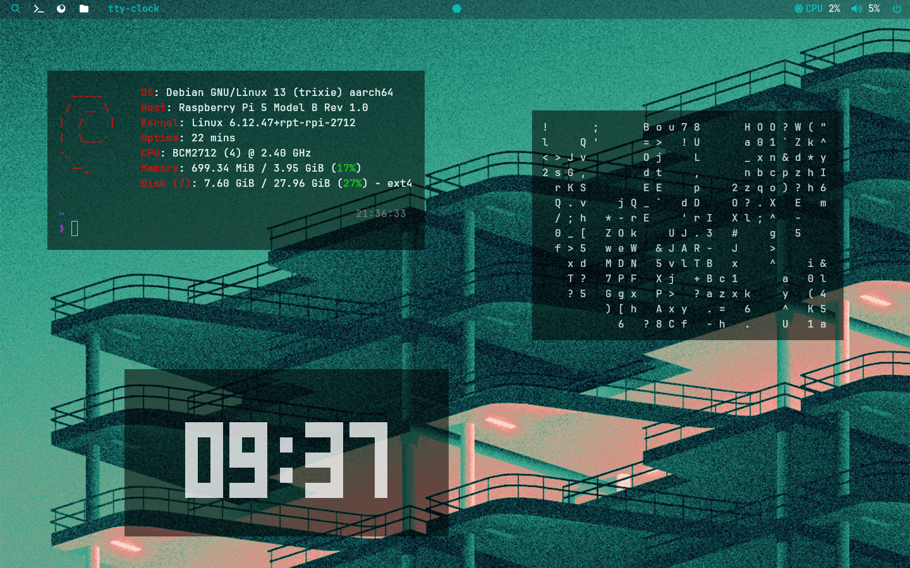
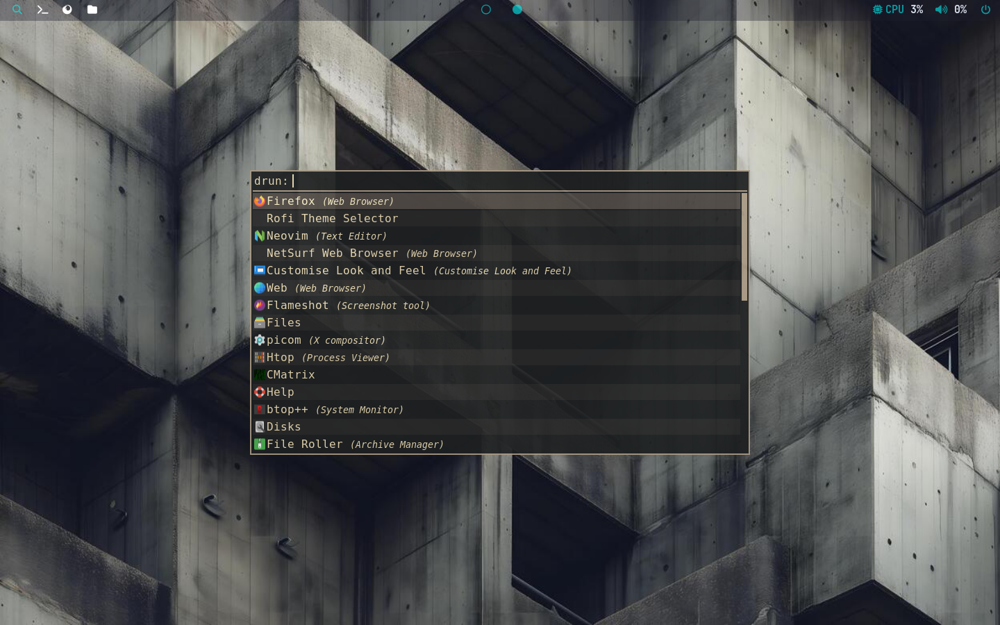
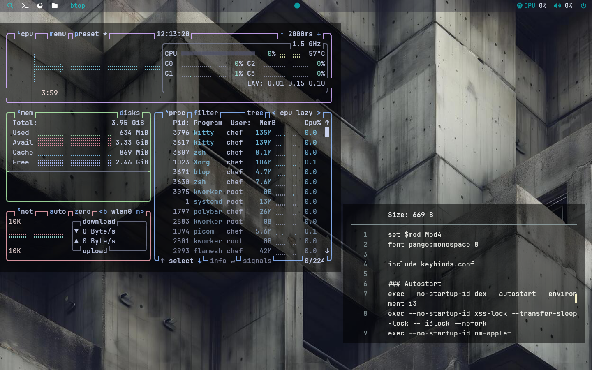
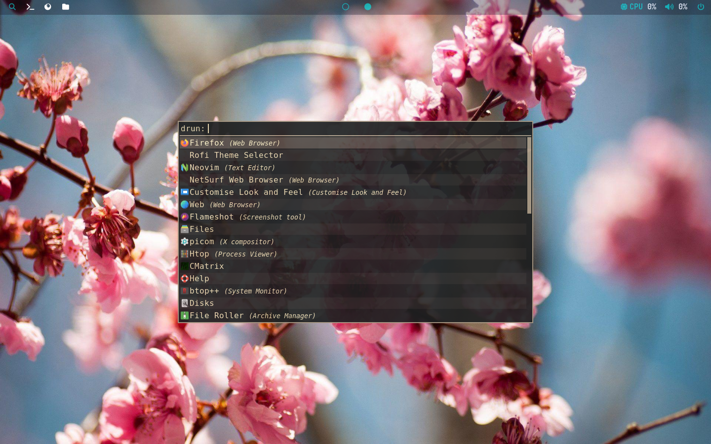

<h1 align="center">i3-dotfile</h1> 

  

  
  
  

# 🐛 ~ Why this configuration? :

This i3wm configuration is designed to run even on the least powerful devices. 
What's more, this configuration is very lightweight and minimalistic, making it perfect for users who want a fast and efficient window manager without any unnecessary bloat.

## ⌨️ Keybindings
| Combo | Action |
|------|--------|
| `Mod + R` | Terminal (kitty) |
| `Mod + E` | File manager (nemo) |
| `Mod + D` | App launcher (rofi) |
| `Mod + B` | Firefox |
| `Mod + W` | Screenshot (flameshot) |
| `Mod + Q` | Close window |
| `Mod + F` | Toggle fullscreen |
| `Mod + G` | Toggle floating |
| `Mod + Space` | Toggle focus mode |

> ⚠️ Work in progress  
> This dotfiles repository is still under active development.

